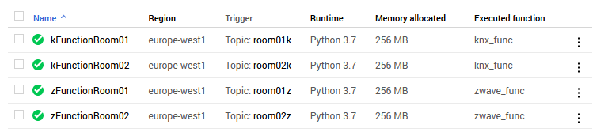
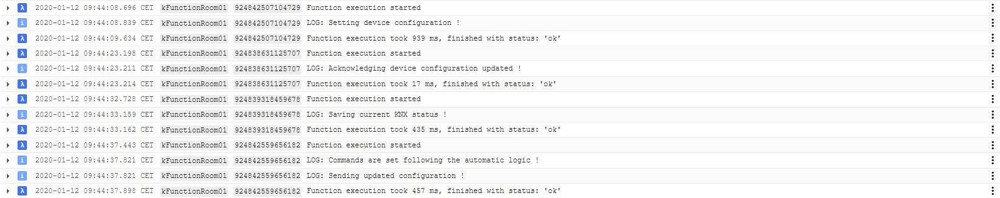
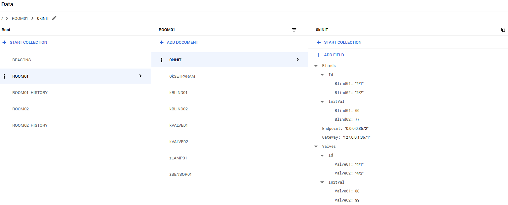
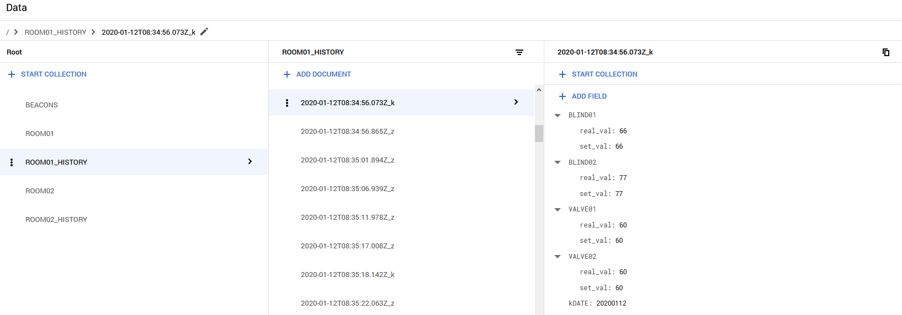
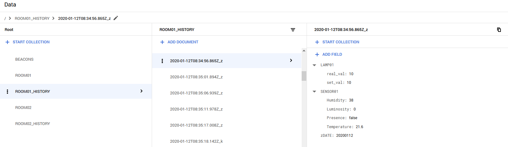

# Google Cloud Platform and Services

For this project, we used the following specific services and tools:
- IoT Core
- Pub/Sub
- Cloud Functions
- Stackdriver Logging
- Firestore

The screen shot below shows their tabs in the Google Cloud Project interface.

For reminder, our application is set up with a set of two rooms, ROOM01 and ROOM02, both containing a set of blinds and radiators, a multi-sensor and a smart-lightbulb.

## IoT Core

We defined for this application a main registry "smarthouse". In the Google Cloud ecosystem, a registry regroups devices that share properties. We could for example define a registry per building, per floor, per set of rooms...

In this registry, two devices were created: one that will deal with KNX processes and communication, and one doing the same for ZWave.

In the registry details, we then need to add topics from the Pub/Sub service that will then be used for specific communication with the devices and for triggering the Google Functions used for processing logic.

The IoT Core service additionally offers us the option to create and set Gateways for MQTT communication. Because our devices were already capable of sending and reading MQTT messages thanks to the SKD and API provided by Google, we opted to work without Gateways.

## Pub/Sub

The configuration using the Pub/Sub service are self-explanatory, we define topics that are used by the devices and the Google Functions for communication and triggers.

## Cloud Functions

In our implementation, we are setting a pair of function per room, one for the KNX processes and one for the ZWave processes. The source code for the functions is provided in the folder [GoogleFunctions](GoogleFunctions). We are using Pyhton 3 for our functions.

Each function is associated with a triggering topic, and excutes a Python function. The source code is the same for each room processes-wise, the modifications come from the differentiation between rooms. This approach is the result of Google Functions allowing only one triggering topic per function. Because we want to segment the traffic between each room for KNX and ZWave devices, we therefore need this pair of function for each room.

The functions are responsible for different processes:
- kFunctions:
  - Reading the MQTT messages from the **serverKNX** device;
  - Updating the Firestore database with new values;
  - Obtaining the values sent by the **serverZWAVE** device from the Firestore database;
  - Obtaining the values sent by the user using the mobile application from the Firestore database;
  - Computing the configuration update for the **serverKNX** device;
  - Sending the updated configuration update;
  - Cleaning the KNX messages stored in the Firestore database after a period of 5 days.
- zFunctions:
  - Reading the MQTT messages from the **serverZWAVE** device;
  - Updating the Firestore database with new values;
  - Obtaining the values sent by the user using the mobile application from the Firestore database;
  - Setting the configuration update for the **serverZWAVE** device;
  - Sending the updated configuration update;
  - Cleaning the ZWave messages stored in the Firestore database after a period of 5 days.

### kFunctions: Processing logic for blinds and radiator valves

We elected to place the processing logic managing the blinds and radiator valves, both automated and manually set by the user, in our kFunctions. The diagram below shows this logic behind for the computation of the updates.

Lorem ipsum dolor.

## Stackdriver logging

Because Google Functions do not provide a debugging tool, we used the Stackdriver Logging service with logging messages to monitor and debug our functions.

## Firestore

We used the Firestore service for the data persistence aspect of our application, allowing us to then provide statistics and over-the-time metrics to the users.

The structure of the database is a follows:
- In each room, two Collections are created:
  - A "ROOM<number>" Collection with the Documents:
    - The kINIT Document, providing the initialisation parameters used for the first configuration of the serverKNX device;
    - The kSETPARAM Document, where temperature, humidity, etc. thresholds can be set;
    - The kBLIND and kVALVE Documents, storing the last measured and setting values (blinds, valves);
    - The zSENSOR Documents, storing the last measured values (temperature, luminosity, humidity, presence);
    - The zLAMP Documents, storing the last measured and setting values (smart-lightbulbs);
  - A "ROOM<number>_HISTORY" Collection, containing the data stored over the last 5 days;
    - Each "k" Document regroups the information for all the KNX-based information, plus a date indicator;
    - Each "z" Document regroups the information for the the ZWave-based information, plus a date indicator.

## Global overview

This final figure sums up the different tools and services used in our application based on the Google Cloud Platform.

