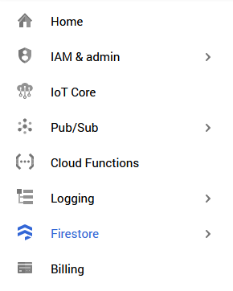

# Google Cloud Platform and Services

For this project, we used the following specific services and tools:
- IoT Core
- Pub/Sub
- Cloud Functions
- Stackdriver Logging
- Firestore

The screen shot below shows their tabs in the Google Cloud Project interface.

