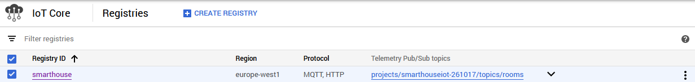
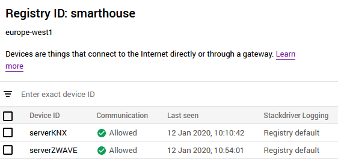
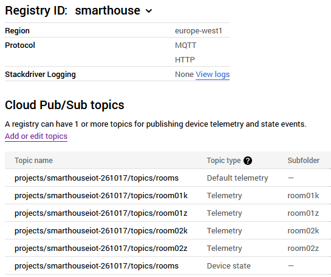

# Google Cloud Platform and Services

For this project, we used the following specific services and tools:
- IoT Core
- Pub/Sub
- Cloud Functions
- Stackdriver Logging
- Firestore

The screen shot below shows their tabs in the Google Cloud Project interface.

## IoT Core

We defined for this application a main registry "smarthouse". In the Google Cloud ecosystem, a registry regroups devices that share properties. We could for example define a registry per building, per floor, per set of rooms...

In this registry, two devices were created: one that will deal with KNX processes and communication, and one doing the same for ZWave.

In the registry details, we then need to add topics from the Pub/Sub service that will then be used for specific communication with the devices and for triggering the Google Functions used for processing logic.

The IoT Core service additionally offers us the option to create and set Gateways for MQTT communication. Because our devices were already capable of sending and reading MQTT messages thanks to the SKD and API provided by Google, we opted to work without Gateways.

## Pub/Sub

The configuration using the Pub/Sub service are self-explanatory, we define topics that are used by the devices and the Google Functions for communication and triggers.

![Subs(GoogleMedia/SmartBuildingSubs.png)

## Cloud Functions

Lorem ipsum dolor

## Stackdriver logging

Lorem ipsum dolor

## Firestore

Lorem ipsum dolor
