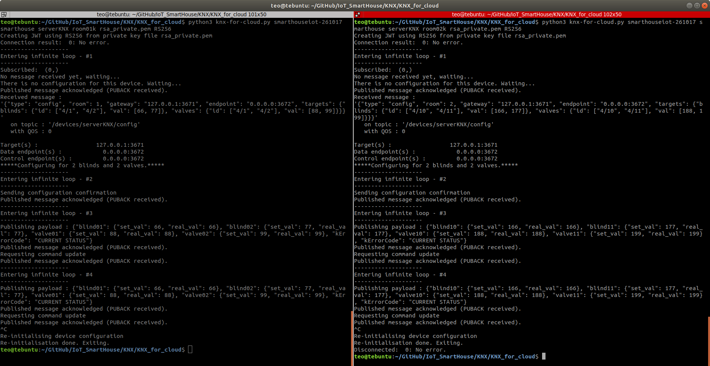

# KNX FOR CLOUD

The `knx-client-cloud.py` Python 3 script is used. Help and arguments description can be obtained using the `python3 knx-client-cloud.py -h` command.

## Running the script

The script is easily set up using the command:

  `python3 knx-client-cloud.py <PROJECT_ID> <REGISTRY_ID> <DEVICE_ID> <TOPIC> <KEY_PATH> <ALGORITHM>`
  
For instance, in our case the following command is used for starting the script and targetting the ROOM01:

  `python3 knx-client-cloud.py smarthouseiot-261017 smarthouse serverKNX room01k rsa_private.pem RS256`
  
# Screens

