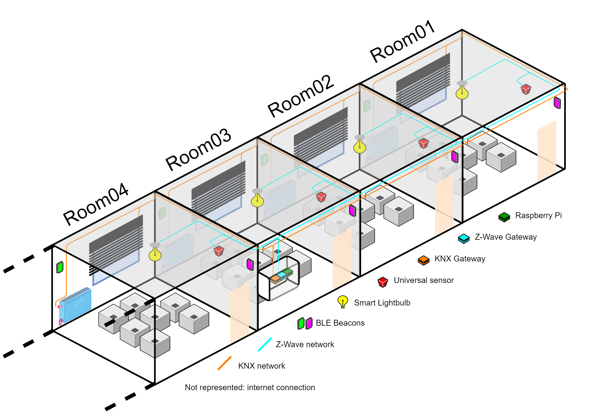
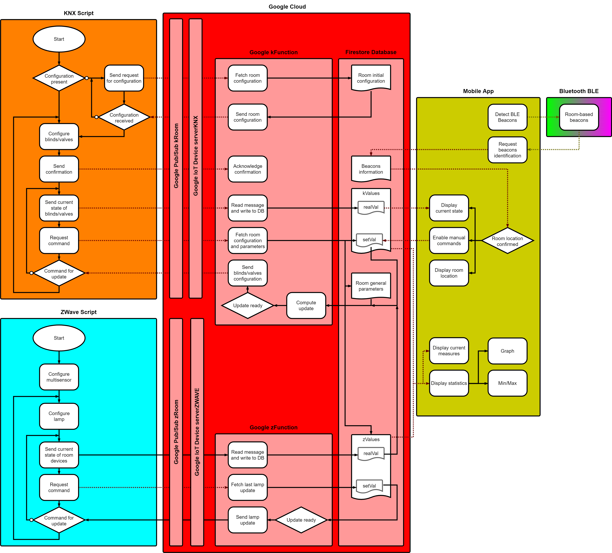

# Contents and intents

This repository contains the resources and related instructions used for the HSE-SO MSE IoT Project “A Smart Building Software based on three home automation communication protocols : KNX, ZWave and BLE (2019-2020)”.

Each folder contains the source and required libraries used :
- KNX
- ZWave
- Beacons

The additional GoogleCloud folder contains the resources and related instructions used for the cloud infrastructure used as a support layer for the project.

# Context of the project

This project is realised as a final project for the HES-SO MSE Internet of Things module. It is the results of the combined efforts of T.B. and A.G.P., completed in January 2020.

# Overview of the developed and implemented solutions

In this project, the considered building infrastructure is a set of rooms equipped with devices such as blinds, radiators, lights, beacons and multi-sensors. For the sake of simplicity, we consider in this description that every room is exactly the same in the buidling with the same devices deployed.

Some of the devices (blinds, radiators, lights, sensors) need a network layer for communication and control. In our application, this is implemented using a set of network-connected devices. We can imagine having a single point, as shown in the figure below (depicted by the Raspberry Pi in green), or multiple ones, dedicated per set of rooms, floors, communication protocols, etc.

The figure below gives a simplified view of the considered buidling infrastructure : a set of rooms, their respective devices and the communication protocols (KNX and ZWave) used to access them, and the network-bound devices system (a set of gateways and a Raspberry Pi in this example).

The next figure shows the global overview of the interaction between the different parts of our system. For our application, we separated the KNX and ZWave processes in two distinct devices, making the implementation and development of the infrastructure easier.

Separated from the building infrastructure, we use an Android application to give users access to the building information (monitoring, measures from the sensors, state of the blinds/radiators/lights, over-time statistics) and location-based (using BLE Beacons) control.

In between, a support layer has been developped using the Google Cloud Platform and Services, including the rooms system and the application used for user control and monitoring. More information are provided in the relevant folder of this repository.

The final figure gives a detailed overview of the main internal and communication processes being used in our infrastructure. This view focuses on the processes responsible for sending and reading messages between the different parts of the ecosystem.

